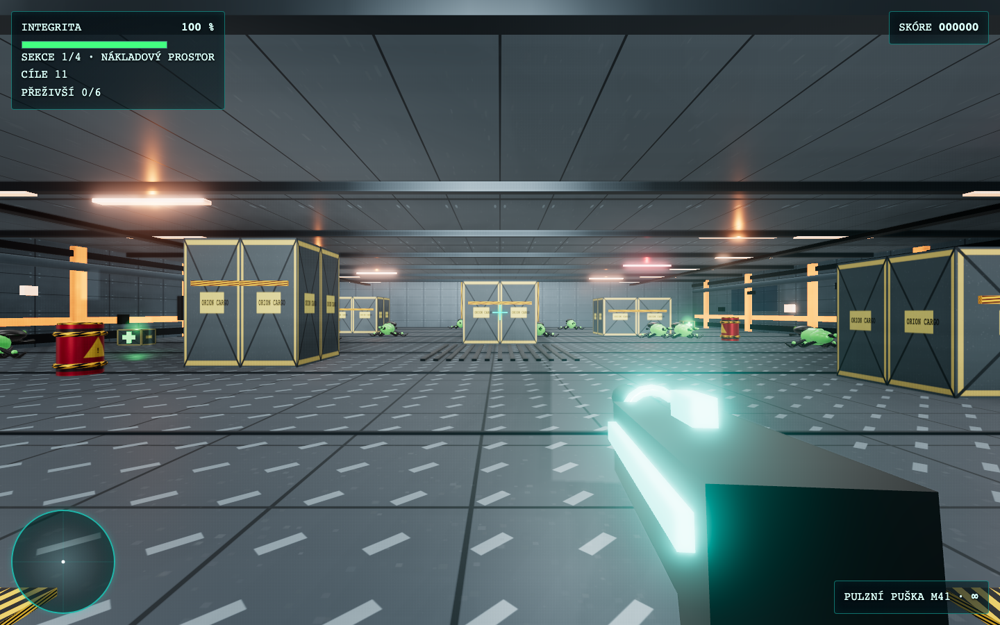
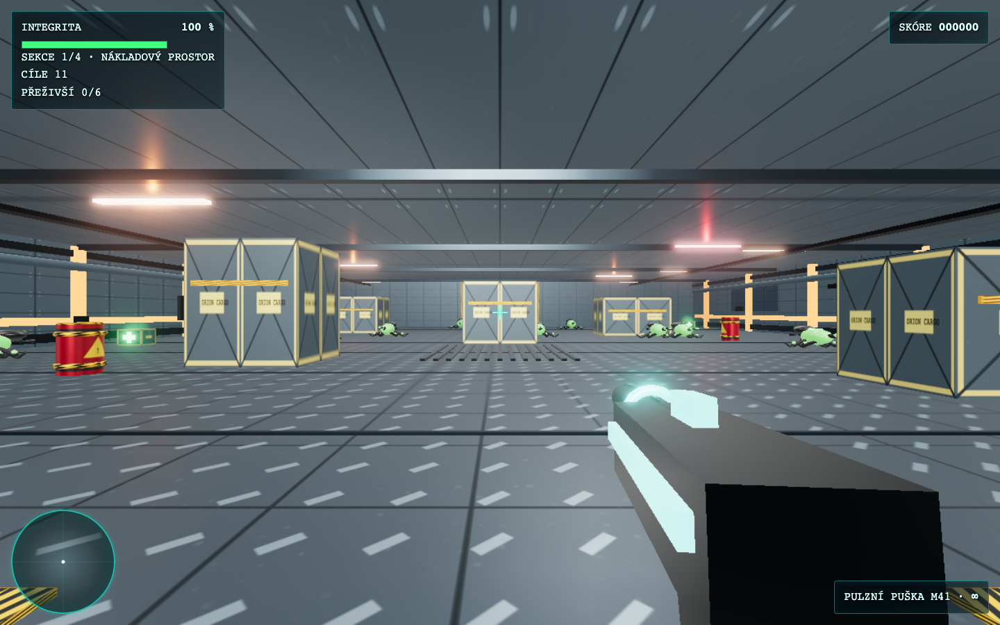

# Vetřelčí stanice

Single-player 3D FPS v prohlížeči. Hráč jako poslední člen posádky čistí devět
sektorů stanice ORION-9, bojuje s různými druhy vetřelců a ukládá skóre do
serverového žebříčku.

Hra používá stylizovanou procedurální grafiku, PBR materiály, generované textury
a procedurální zvuky. Za běhu nevyžaduje žádné CDN ani externí služby.

## Funkce

- devět sektorů ORION-9 (Unity → Zarja → … → reaktorové jádro) s torus chodbou a válcovými moduly,
- plazivci, stropní lovci, pozemní lovci, plivači, elitní varianty a bossové včetně finále s Královnou,
- zrak (LOS) a sluch nepřátel — schovávání za přepážkami a alarm výstřely,
- náhodné spawny nepřátel a pickupů při každém běhu (`?test=1` = deterministický seed),
- FPS ovládání přes Pointer Lock API a kolize se substeppingem,
- pulzní puška, brokovnice a plamenomet s perzistentní municí v rámci runu,
- výbušné sudy, airlock, kyslíkové zóny, sentry věžička a záchrana přeživších,
- šedesátisekundový únik po porážce Královny,
- lékárničky, radar, rozšířený HUD, nastavitelný jas a dva režimy kvality,
- ACES/SRGB rendering, environment odlesky, bloom, SSAO a měkké stíny,
- procedurální panelové, podlahové, výstražné a terminálové textury,
- detailní animovaní vetřelci, viewmodely zbraní a additivní částicové efekty,
- bezpečný start každé sekce a stropní lovci s balistickým přepadem,
- top 10 leaderboard uložený v SQLite,
- FastAPI + Jinja2 + HTMX, lokálně uložené Three.js a HTMX,
- cache busting: `Cache-Control: no-cache` + `?v=` u assetů (žádný mix starých/nových ES modulů),
- non-root Docker image s healthcheckem.

## Lokální spuštění

Požadavky: Python 3.12+ a počítač s klávesnicí a myší. Node.js je potřeba
pouze pro vývojové testy, nikoli pro běh hry.

```bash
python3 -m venv .venv
source .venv/bin/activate
pip install -r requirements.txt
DB_PATH=./data/scores.db uvicorn app.main:app --reload
```

Hra bude dostupná na `http://localhost:8000`.

Ovládání: `WASD`/šipky pohyb, myš rozhlížení, levé tlačítko palba,
`1`/`2`/`3` nebo kolečko přepínání zbraní, `E` airlock, `T` věžička a `Esc`
pauza. Jas i režim kvality se ukládají do `localStorage`.

VYSOKÁ kvalita používá bloom, SSAO, měkké stíny, čtyřnásobný MSAA render
target a textury 1024 px. NÍZKÁ ponechává slabší bloom, vypíná SSAO/stíny,
snižuje pixel ratio a používá textury 512 px. Změna kvality se aplikuje při
dalším načtení hry.

## Docker

Volitelně vytvoř lokální konfiguraci:

```bash
cp .env.example .env
mkdir -p data
```

Na Linux hostiteli nastav oprávnění volume pro non-root uživatele:

```bash
sudo chown -R 1000:1000 ./data
```

Sestavení a spuštění:

```bash
docker compose up -d --build
docker compose ps
```

Hra poběží na `http://localhost:8080`. `version.json` se při sestavení image
vygeneruje ve formátu `v.YYYYMMDD.HHMM`.

## Konfigurace

| Proměnná | Výchozí hodnota | Význam |
|---|---|---|
| `DB_PATH` | `/app/data/scores.db` | Cesta k SQLite databázi |
| `TZ` | `Europe/Prague` | Časová zóna kontejneru |
| `APP_NAME` | `Vetřelčí stanice` | Název zobrazený v UI |
| `SCORE_MAX` | `1000000` | Serverový strop přijatého skóre |

Soubor `.env` se necommituje. Projekt nevyžaduje žádné tajné údaje.

## API

- `GET /` – Jinja2 shell hry.
- `GET /partials/leaderboard` – HTML partial s top 10 výsledky.
- `POST /api/scores` – uloží JSON `{"name":"Ripley","score":1250,"level":4}`.
- `GET /api/docs` – vývojová OpenAPI dokumentace.

Jméno se trimuje a musí mít 1–20 znaků, skóre musí být nezáporné a pod
`SCORE_MAX`, úroveň je 1–4. Leaderboard je veřejný a bez účtů; serverová
validace omezuje nesmyslné hodnoty, ale u čistě klientské hry nemůže zabránit
záměrně podvrženým výsledkům.

## Struktura

```text
app/
├── main.py, db.py, models.py
├── templates/
│   ├── index.html
│   └── partials/leaderboard.html
└── static/
    ├── css/app.css, css/game.css
    ├── libs/three.module.js, three.core.js, htmx.min.js
    ├── libs/addons/       # lokální Three.js r185 post-processing/environment
    └── js/config.js, main.js, rendering.js, textures.js, visual-utils.js,
       collision.js, player.js, enemies.js, levels.js, pickups.js,
       barrels.js, systems.js, hud.js, audio.js, api.js
data/                  # persistentní SQLite volume
tests/                 # pytest, Vitest a Playwright testy
```

## Ověření

```bash
pip install -r requirements-dev.txt
npm install
npx playwright install chromium
./scripts/test-all.sh
docker compose config
docker compose up -d --build
curl -f http://localhost:8080/
```

Podrobný automatický i manuální checklist je v [TESTING.md](TESTING.md).
V síťovém panelu nemají být žádné externí requesty.

## Volitelné CC0 assety

Aktuální build žádné externí modely ani textury nepotřebuje a používá
procedurální fallbacky. Pro budoucí integraci lze připravit:

```text
app/static/assets/
├── models/       # GLTF/GLB modely; měřítko v metrech, transformace bez koliderů
└── textures/     # PBR sady: *_color, *_normal, *_roughness
```

Vizuální asset nesmí měnit hitbox, gameplay rozměr ani AABB. Dokud příslušná
složka neexistuje a není namapovaná v kódu, hra zůstává plně procedurální.

Pro výkonovou diagnostiku spusť `/?debug=1`. Overlay zobrazuje FPS, draw calls,
trojúhelníky, geometrie, textury a aktivní rendering profil.

## Náhled v3.1

VYSOKÁ kvalita:



NÍZKÁ kvalita:



## Nasazení

### Vývoj (lokální build)

V `docker-compose.yml` je aktivní sekce `build`. Spuštění:

```bash
docker compose up -d --build
```

Rebuild po změnách:

```bash
docker compose up -d --build
```

### Produkce (image z GHCR)

V `docker-compose.yml` zakomentuj `build` a odkomentuj `image`:

```yaml
services:
  vetrelci-stanice:
    # build:
    #   context: .
    #   dockerfile: Dockerfile
    image: ghcr.io/elvisek2020/web-space_nothingness:latest
```

Spuštění a update:

```bash
docker compose pull
docker compose up -d
```

Image v GitHub Container Registry:

- **Latest:** `ghcr.io/elvisek2020/web-space_nothingness:latest`
- **Konkrétní commit:** `ghcr.io/elvisek2020/web-space_nothingness:sha-<commit-sha>`

Po prvním CI buildu nastav v GitHub Packages viditelnost image na **Public**
(pokud má být pull bez přihlášení). U private image je nutný login:

```bash
echo $GITHUB_TOKEN | docker login ghcr.io -u USERNAME --password-stdin
```

### Produkční server

Cílová cesta je `/opt/docker/vetrelci-stanice/`. Zkopíruj projekt nebo jen
`docker-compose.yml` a `.env`, připrav `data/` s vlastníkem `1000:1000` a spusť
Docker Compose. V Nginx Proxy Manageru nastav upstream na host a port `8080`,
WebSocket hra nepotřebuje. Veřejně publikuj pouze HTTPS; SQLite volume pravidelně
zálohuj.
